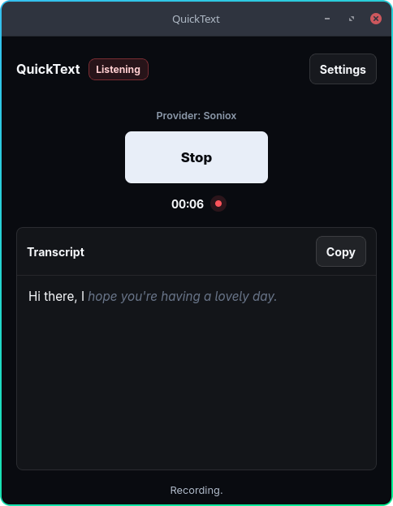

# QuickText

Fast speech-to-text dictation for your desktop. Press a key, speak, get text.

QuickText turns your voice into text in seconds. Start, speak, stop—then copy your transcript or let QuickText paste it straight into the focused app. Transcription streams through your selected provider, [Soniox](https://soniox.com) or [Deepgram](https://deepgram.com), while you speak.



## Features

- One-key dictation: start and stop with a single action.
- Real-time transcription through Soniox (default) or Deepgram.
- Shared terms and phrases to improve recognition; Deepgram currently supports English.
- Instant copy-to-clipboard for the latest transcript.
- Lives in the system tray; closing the window keeps the app running.
- Capture-first UI with settings (API key, shortcuts) kept out of the way.
- Companion CLI for compositor bindings, scripts, and other apps.
- Cross-platform: Linux, macOS, and Windows.

## Installation

Download an unsigned prebuilt package from the rolling [pre-release](https://github.com/dipta10/QuickText/releases), which is rebuilt on every merge to `main`:

| Your computer | Download |
|---|---|
| Windows | `QuickText_0.1.0_x64-setup.exe` (installer) or `.msi` |
| Mac (Apple Silicon) | `QuickText_0.1.0_aarch64.dmg` |
| Linux | `.AppImage` (just run it) or `.deb` / `.rpm` |

### Prerequisites

- Node.js and npm
- Rust toolchain
- Tauri 2 [system dependencies](https://tauri.app/start/prerequisites/) for your platform

### Build From Source

```bash
git clone https://github.com/dipta10/quicktext.git
cd quicktext
npm install
npm run tauri build
```

The binary is written to `src-tauri/target/release/quicktext`.

## Usage

Launch `quicktext` to start the app. It stays resident in the tray until you quit it explicitly.

1. Press the record button (or your global shortcut) to start listening.
2. Press again to stop.
3. Copy the transcript from the window.

Choose a provider and save its API key in Settings. Keys are stored separately in the system keyring, never in plain files. Soniox supports automatic detection and language preferences; Deepgram uses English in this release.

## CLI On Linux

The same binary doubles as a CLI for driving a running instance over a local socket — ideal for Wayland compositors like Hyprland or Sway, where X11 global shortcuts do not work.

```bash
# Launch the GUI
quicktext

# Toggle recording
quicktext toggle

# Toggle plus window management:
# shown/focused on start, hidden once the transcript is ready
quicktext toggle focus

# Show/focus or hide the window; recording is unchanged
quicktext toggle-window
quicktext toggle-window --json

# Print current state without changing anything
quicktext status

# Machine-readable output
quicktext status --json
```

Settings provides separate **Recording shortcut** and **Window shortcut** controls.
Choose different keys for each; both are restored when QuickText starts. The window
shortcut shows and focuses a hidden/minimized window or hides a visible window to
the tray, even during recording. It never quits the app.

`toggle-window --json` returns `{"ok":true,"visible":true}` when shown and
`{"ok":true,"visible":false}` when hidden. The resident app must already be running.
The CLI transport is implemented on Linux/macOS; Windows IPC remains unsupported.

Exit codes: `0` success, `1` failure, `2` app not running.

Bind it to a key in Hyprland:

```ini
bind = , F10, exec, quicktext toggle focus
bind = , F11, exec, quicktext toggle-window
```

Or Sway:

```ini
bindsym F10 exec quicktext toggle focus
bindsym F11 exec quicktext toggle-window
```

## Documentation

- [Product brief](docs/product-brief.md)
- [Technical plan](docs/technical-plan.md)
- [Architecture decisions](docs/adrs/)

## License

[MIT](LICENSE). QuickText is free to use; transcription runs through your own selected-provider account and API key; provider usage and billing apply.
